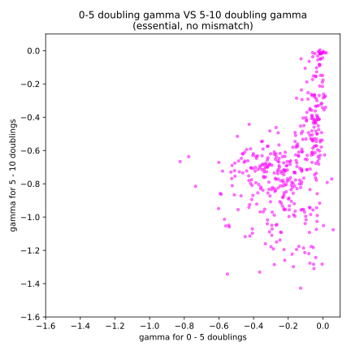
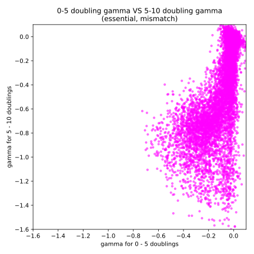
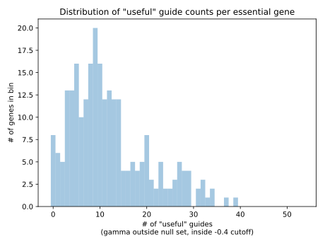

Analysis
========

* Growth of Library 2 (Genome-wide Essential Knockdowns)
* Full Induction (1% Xylose)

code/parent_front_v_back_20171129
---------------------------------

.. include:: output/parent_front_v_back_20171129.notes

code/child_front_v_back_20171129
---------------------------------

.. include:: output/child_front_v_back_20171129.notes

code/useful_by_gene_20171126
---------------------------------

.. include:: output/useful_by_gene_20171126.notes

