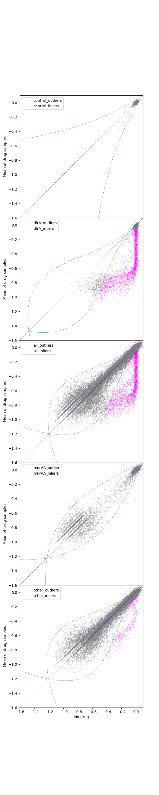
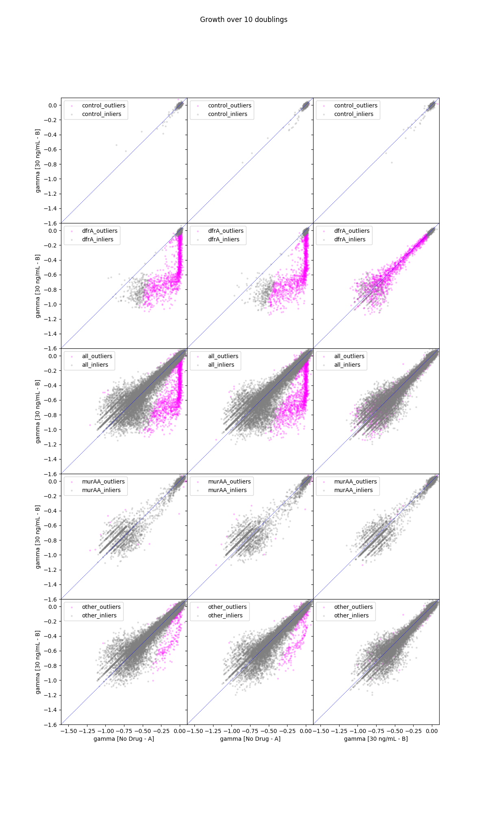

========
Analysis
========

* Growth of Library 2 (Genome-wide Essential Knockdowns)
  * With addition "spike-in" of libraries 3/4 (muraa and dfra comprehensive libraries)
* Full Induction (1% Xylose)

code/no_vs_heavy_drug_20180129.py
---------------------------------

.. include:: output/no_vs_heavy_drug_20180129.notes
.. image:: output/no_vs_heavy_drug_20180129.svg

code/no_vs_heavy_drug_5_20180129.py
-----------------------------------

.. include:: output/no_vs_heavy_drug_5_20180129.notes
.. image:: output/no_vs_heavy_drug_5_20180129.svg

code/no_vs_heavy_drug_midspan_20180129.py
-----------------------------------------

.. include:: output/no_vs_heavy_drug_midspan_20180129.notes
.. image:: output/no_vs_heavy_drug_midspan_20180129.svg

Things to try next
------------------

* Change graphs to reflect "high" drug dose
* Compare A to C, B to C (!)
* 7.5 -> 10 check
* Graph

  * dfrA only
  * murAA only
  * controls only
  * "other" only

* Examine "unaffected" guides

  * we can arguably treat drug cases as replicates, look for patterns as before

code/no_vs_heavy_drug_late_20180129.py
-----------------------------------------

.. include:: output/no_vs_heavy_drug_late_20180129.notes
.. image:: output/no_vs_heavy_drug_late_20180129.svg

code/subsets_full_20180129.py
-----------------------------------------

.. include:: output/subsets_full_20180129.notes
.. image:: output/subsets_full_20180129.svg

code/subsets_early_20180129.py
-----------------------------------------

.. include:: output/subsets_early_20180129.notes
.. image:: output/subsets_early_20180129.svg

code/subsets_mid_20180129.py
-----------------------------------------

.. include:: output/subsets_mid_20180129.notes
.. image:: output/subsets_mid_20180129.svg

code/subsets_late_20180129.py
-----------------------------------------

.. include:: output/subsets_late_20180129.notes
.. image:: output/subsets_late_20180129.svg

code/std_mean_reshape_20180205.py
---------------------------------

.. include:: output/std_mean_reshape_20180205.notes

code/reshape_outliers_20180205.py
---------------------------------

.. include:: output/reshape_outliers_20180205.notes

hand-copied top hits from reshape
---------------------------------

======   =====
gene     count
======   =====
dfrA     1107
folK       45
murAA      44
folEA      37
sul        35
folB       30
folC       26
folD       14
ymdA        9
mraY        6
ylaN        6
trxB        4
ftsA        4
ugtP        3
aroD        3
murD        3
murF        2
rpsE        2
holB        2
atpG        2
======   =====

TODO list as of 20170206
------------------------
* Switch to PCA
* compare inliers to outliers -- are inliers lower phenotype overall?
* fisher's exact test to see where the count line should be
* fit a curve to each gene's points.  ask a question about the curve.
* Can we separate the outer outliers?
* Account for / normalize the overall drift at each sub-sample.

